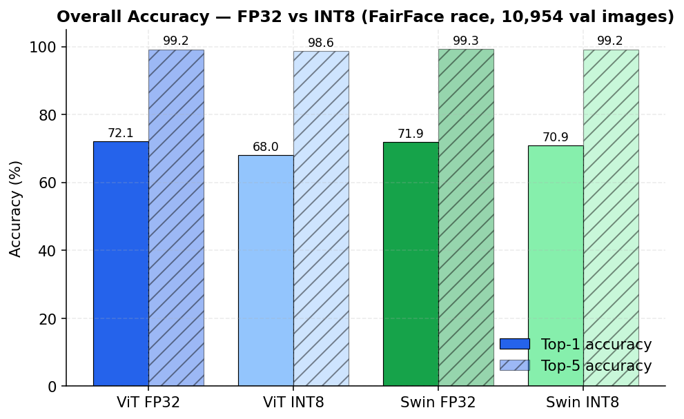
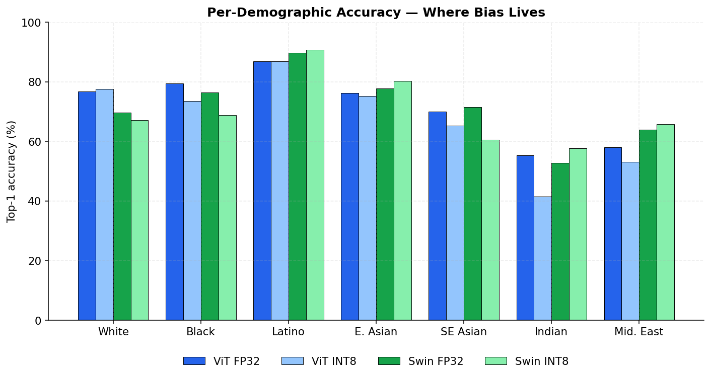
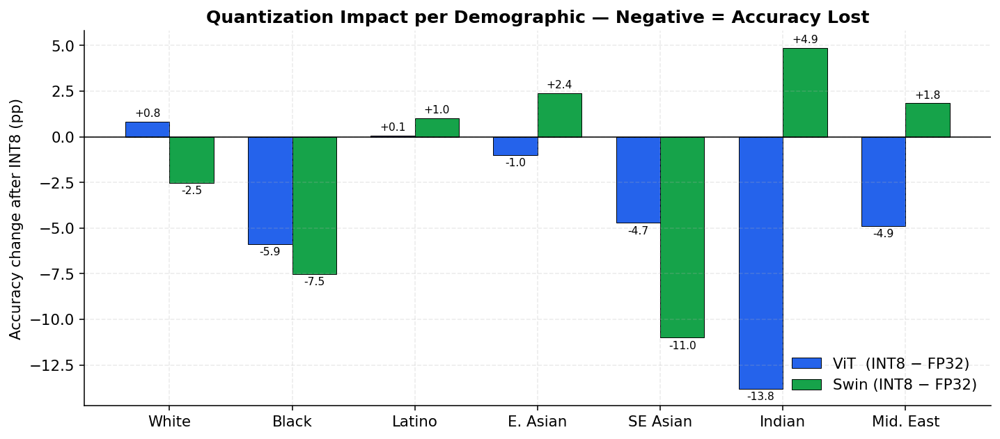
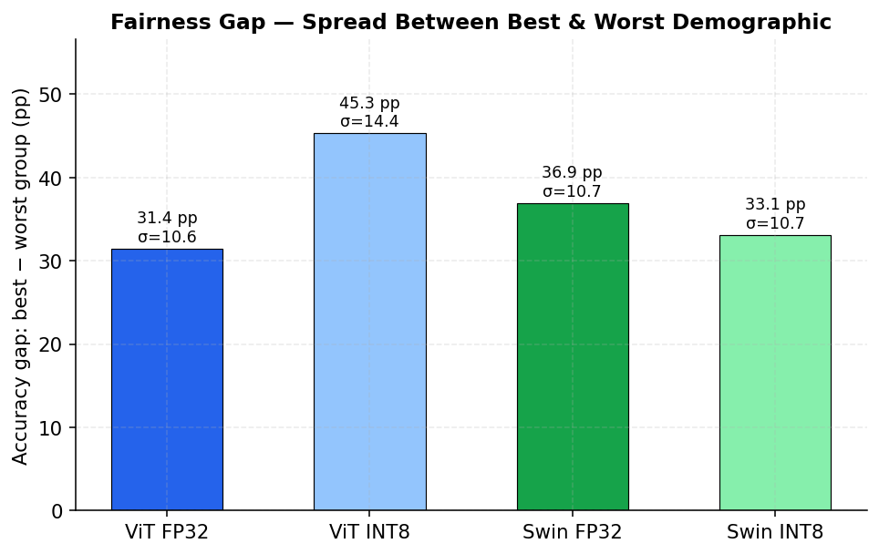
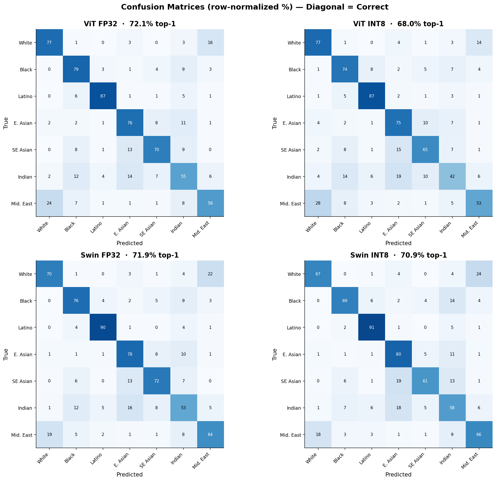
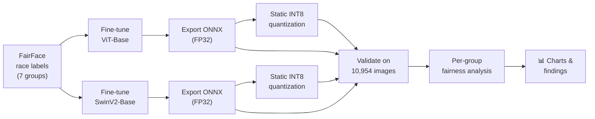
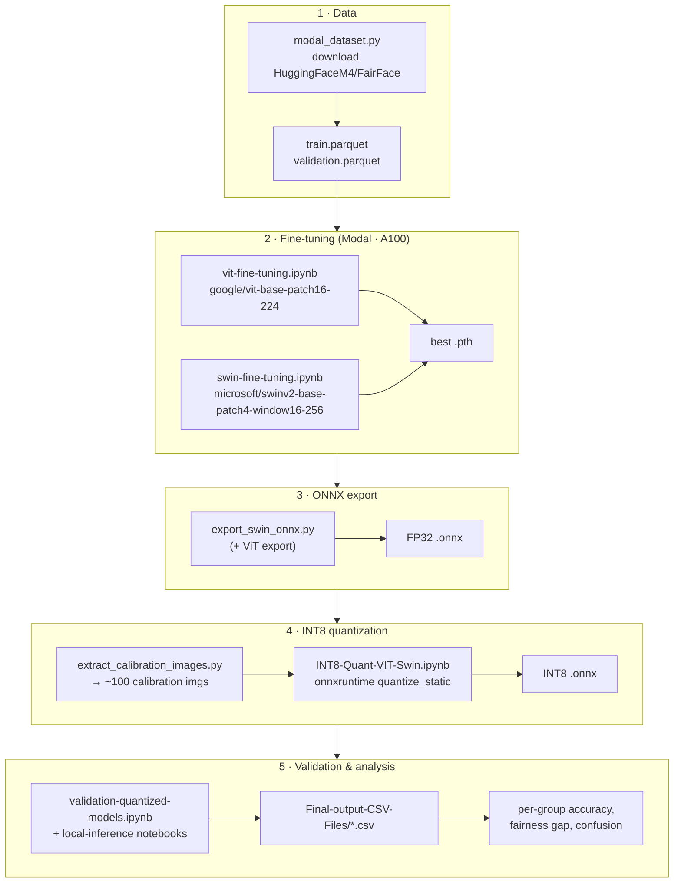

# Does INT8 Quantization Make Vision Transformers *More* Biased?

### A fairness audit of ViT vs. Swin on FairFace, before and after INT8 quantization

<p align="center">
  
  
  
  
  
</p>

---

## 🔭 TL;DR

Quantizing a model to INT8 is the standard trick for shrinking it and making it run cheaply on edge devices. The usual assumption is *"you lose a little accuracy, but it's fine."* **This project asks a different question: is that lost accuracy spread evenly across demographic groups, or does quantization quietly make the model less fair?**

I fine-tuned two vision transformers — **ViT** and **SwinV2** — on the [FairFace](https://github.com/joojs/fairface) race-classification task, quantized both to INT8, and ran a full demographic breakdown of all four models over the 10,954-image validation set.

**Three findings:**

1. **Quantization is not demographically neutral.** For ViT, INT8 doesn't just cost ~4 points of accuracy — it *concentrates* that loss on already-underserved groups. The **Indian** group alone drops **−13.8 points**, and the gap between the best and worst group widens from **31 → 45 points**.
2. **Architecture decides quantization robustness.** SwinV2 loses only **−1.0 point** overall to INT8 (vs. ViT's **−4.1**) and keeps its fairness gap roughly stable. If you must quantize, the backbone you pick matters more than the quantization recipe.
3. **Both models share the same bias fingerprint.** Regardless of architecture or precision, accuracy is highest on **Latino_Hispanic / White** and lowest on **Indian / Middle Eastern** — a bias inherited from the data and representation, not the quantization.

> **Takeaway for deployment:** "ship the smaller INT8 model" is a fairness decision, not just an efficiency one. It needs a per-group audit, not a single accuracy number.

---

## 📊 Results

### 1. Overall accuracy — the headline number hides the story

<p align="center"></p>

| Model | Top-1 | Top-5 | Δ Top-1 vs FP32 |
|---|---:|---:|---:|
| ViT&nbsp;FP32  | **72.1%** | 99.2% | — |
| ViT&nbsp;INT8  | 68.0% | 98.6% | **−4.1 pp** |
| SwinV2&nbsp;FP32 | **71.9%** | 99.3% | — |
| SwinV2&nbsp;INT8 | 70.9% | 99.2% | **−1.0 pp** |

Both full-precision models are basically tied (~72%). INT8 looks "cheap" for Swin and "moderately costly" for ViT — but a single accuracy number is exactly what hides the fairness problem below.

### 2. Where the bias lives — per-demographic accuracy

<p align="center"></p>

Every model is **20–35 points better** on its best group than its worst. **Indian** and **Middle Eastern** faces are the hardest for all four models; **Latino_Hispanic** and **White** are the easiest. This profile is consistent across architecture *and* precision — it is a property of the learned representation, not an artifact of quantization.

### 3. Quantization impact per group — the unfairness amplifier

<p align="center"></p>

This is the core result. Each bar is the **accuracy change after INT8** for one group.

- **ViT (blue)** loses accuracy almost everywhere, and the damage is *worst on the groups that were already worst* — Indian **−13.8 pp**, Middle Eastern **−4.9 pp**, Black **−5.9 pp**. Quantization here is a fairness *regression*.
- **SwinV2 (green)** is far more graceful: it even *gains* on several groups (Indian **+4.9 pp**, East Asian **+2.4 pp**) while giving back a little on others. Net effect: its fairness gap stays roughly flat.

### 4. Fairness gap — best group minus worst group

<p align="center"></p>

| Model | Best group | Worst group | **Fairness gap** | Std-dev across groups |
|---|---:|---:|---:|---:|
| ViT&nbsp;FP32  | Latino 86.8% | Indian 55.3% | 31.4 pp | 10.6 |
| **ViT&nbsp;INT8**  | Latino 86.8% | Indian 41.5% | **45.3 pp** ⬆️ | 14.4 |
| SwinV2&nbsp;FP32 | Latino 89.7% | Indian 52.8% | 36.9 pp | 10.7 |
| SwinV2&nbsp;INT8 | Latino 90.8% | Indian 57.7% | 33.1 pp | 10.7 |

Quantization **widens** ViT's gap by ~14 points but leaves Swin's essentially unchanged — direct evidence that quantization's fairness cost is architecture-dependent.

### 5. Confusion matrices — *how* the models fail

<p align="center"></p>

Row-normalized (%). The off-diagonal mass shows the systematic confusions — e.g. *Middle Eastern → White/Indian* and *Southeast Asian → East Asian/Indian* — and how those confusions intensify in the INT8 panels for ViT.

---

## 🧠 The Idea & Experimental Design



The design is a clean **2 × 2 factorial**: two architectures (**ViT**, **SwinV2**) × two precisions (**FP32**, **INT8**). Holding the dataset, training recipe, and validation set fixed lets every accuracy difference be attributed to exactly one of those two axes — which is what makes "quantization amplifies ViT's bias" a defensible claim rather than a coincidence.

### End-to-end pipeline



### Method details

| Stage | Choice | Notes |
|---|---|---|
| **Dataset** | FairFace (`1.25` padding), 7 race classes | ~86k train / 10,954 val |
| **ViT** | `google/vit-base-patch16-224`, 224×224 | AdamW, lr 2e-5, 10 epochs, ImageNet norm |
| **SwinV2** | `microsoft/swinv2-base-patch4-window16-256`, 256×256 | AdamW, lr 2e-5, 10 epochs, processor norm |
| **Compute** | Modal cloud, A100 GPUs | distributed via 🤗 Accelerate |
| **Quantization** | Static INT8 via ONNX Runtime `quantize_static` | calibration with ~100 held-out images |
| **Evaluation** | ONNX Runtime over full val split | top-1 / top-5, per-group breakdown |

---

## 🗂️ Repository Structure

```
.
├── README.md
├── requirements.txt
│
├── modal_dataset.py                  # Download FairFace → parquet (Modal volume)
├── extract_calibration_images.py     # Sample calibration images for static quant
├── export_swin_onnx.py               # Export fine-tuned Swin .pth → ONNX
│
├── vit-fine-tuning.ipynb             # Fine-tune ViT-Base on FairFace
├── swin-fine-tuning.ipynb            # Fine-tune SwinV2-Base on FairFace
├── INT8-Quant-VIT-Swin.ipynb         # Static INT8 quantization of both models
├── validation-quantized-models.ipynb # Full-val validation → CSV
├── vit-local-inference.ipynb         # Single-image ViT inference / demo
├── Swin-local-inference.ipynb        # Single-image Swin inference / demo
│
├── Final-output-CSV-Files/           # 📊 Raw results — one row per val image
│   ├── VIT-BASE-validation.csv
│   ├── VIT-INT8-Quantized-Validation.csv
│   ├── Swin-Base-validation.csv
│   └── Swin-INT8-Quantized-Validation.csv
│
├── assets/                           # 📈 Generated analysis figures
│   └── 01..05_*.png
│
└── sample-test-pictures/             # 🖼️ Example faces for quick local inference
```

> **Note on weights:** the fine-tuned `.pth` / `.onnx` checkpoints and the FairFace parquet files are **not** committed (too large, and the data is redistributable only from its original source). Regenerate them by running the notebooks in order — every step is reproducible from the scripts here. See `.gitignore`.

---

## 🔁 Reproducing the Analysis

The four CSVs in `Final-output-CSV-Files/` are the raw per-image predictions for all four models. The figures in `assets/` are generated entirely from them — no GPU or model weights required:

```bash
python -m venv .venv && source .venv/bin/activate
pip install pandas matplotlib numpy
python make_figures.py        # regenerates assets/01..05_*.png + assets/metrics.json
```

To reproduce the models from scratch (GPU / Modal account needed):

```bash
pip install -r requirements.txt
python modal_dataset.py                  # 1. download FairFace
# 2. run vit-fine-tuning.ipynb & swin-fine-tuning.ipynb (Modal A100)
python export_swin_onnx.py               # 3. export to ONNX
python extract_calibration_images.py     # 4a. build calibration set
# 4b. run INT8-Quant-VIT-Swin.ipynb       # quantize to INT8
# 5. run validation-quantized-models.ipynb → Final-output-CSV-Files/
```

---

## ⚠️ Limitations & Future Work

- **FairFace's "race" labels** are coarse, socially constructed proxies; results describe model behavior on *this* taxonomy, not ground truth about people.
- Single training run per model (no seed averaging) — group-level deltas of a few points should be read as directional, not significant to the decimal.
- Only **static INT8** is tested; dynamic quantization, INT4, and quantization-aware training are natural next steps.
- A bias-*mitigation* pass (class-balanced loss, calibration-set reweighting) would turn this audit into an intervention.

---

## ✍️ Author

Research project on **fairness-aware model compression** for vision transformers. The thesis throughout: *a model-compression decision is also a fairness decision, and the only way to know its cost is to measure it per group.*
